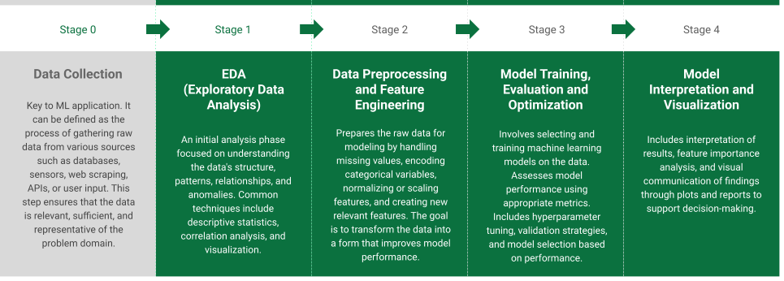

# Kuka

**Kuka** is a Python library designed to support exploratory data analysis (EDA), data modeling, and interpretation of machine learning models.  

Its main goal is to serve as a practical reference toolkit throughout the various stages of a machine learning pipeline.

While major libraries like `scikit-learn`, `pandas`, and `matplotlib` offer robust general-purpose tools, **Kuka** fills the gaps by providing streamlined and customized utilities for tasks that are commonly needed but not readily available out-of-the-box.

## Key Features

- Simplified tools for data exploration and visualization  
- Utilities for model interpretation and diagnostics  
- Automation-friendly interfaces for analysis workflows

The API is organized based on 4 of the 5 classical stages of a typical ML application:

1. Exploratory Data Analysis (EDA)  
2. Feature Engineering and Modeling  
3. Model Training and Evaluation  
4. Interpretation and Visualization  

> 📌 *Note: This library is in active development and aims to evolve with practical needs from real-world ML projects.*

## Built With   

- `pandas`  
- `numpy`  
- `matplotlib`  
- `scipy`  
- `scikit-learn`  
- `seaborn`
